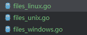

# cursor-reset-go
golang reset Cursor editor's device identification system. （重置Cursor的设备问题）


## Installation & Usage

```bash
go build 
```

本项目是由 https://github.com/ultrasev/cursor-reset.git 移植而来<br>
由于原版本是py,所以本版本用go移植了一次,支持多操作系统的条件编译

